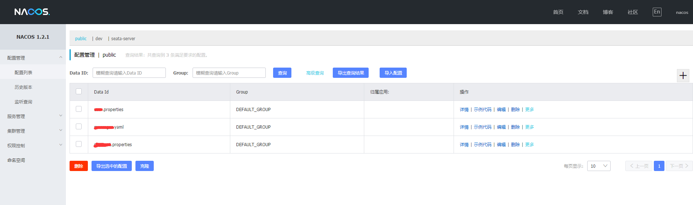
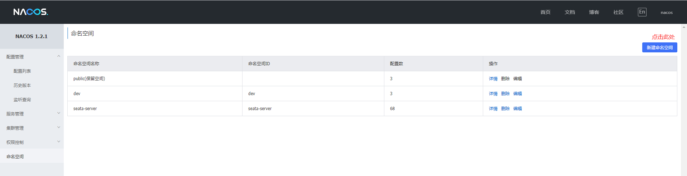
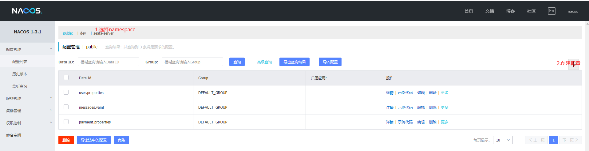
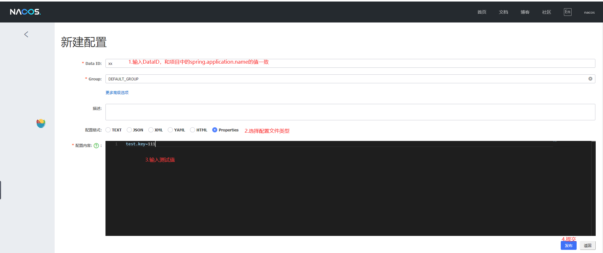
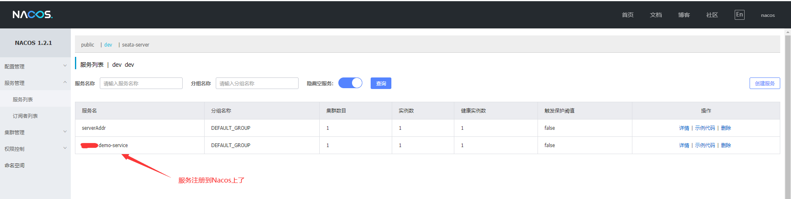

* content
{:toc}

## 背景
在国内集成SpringCloud(下面简称：SC)，在SC1.0版本的时候，基本上选择的都是Netflix开源的众多组件，比如：服务发现Eureka、客户端负载均衡Ribbon、熔断器Hystrix、服务网关Zuul等开源组件；但在SC2.0版本之后，情况发现了改变，比如：服务发现Eureka闭源、Hystrix不在进行后续开发等问题。使得我们不得不寻找替换的组件，幸运的是阿里巴巴集成提供了一整套的可替换的开源组件，下面主要围绕集成SpringCloud Alibaba开源框架进行展开。

## 版本

| 包                        |     版本                                  |
| ------------------------- |------------------------------------------|
| spring-boot               |     2.1.13.RELEASE                       |
| spring-cloud              |     Greenwich.SR5                        |
| spring-cloud-alibaba      |     2.1.0.RELEASE                        |

根据[spring-cloud-alibaba版本](https://github.com/alibaba/spring-cloud-alibaba/releases/tag/v2.1.0.RELEASE)中明确说明的兼容性，进行整理SC和spring-boot版本保持一致

## 组件
spring-cloud-alibaba框架下提供了如下几个组件：
- Nacos：服务发现 和 配置中心
- Seata：分布式事务
- Dubbo：RPC服务框架
- Sentinel：流控组件
- RocketMQ：消息中间件（未使用，集成了RabbitMQ）
- OSS：对象存储服务组件

1. Nacos
    [nacos](https://nacos.io/zh-cn/index.html)是使用SpringBoot进行编写的组件，面向云原生方面进行开发的，提供可视化的操作界面，功能强大，集成也非常方面。集成步骤有：
    1.1 搭建Nacos后台服务，参考[Nacos部署模式](https://nacos.io/zh-cn/docs/deployment.html),效果如图：
    
    1.2	配置namespace
    
    1.3 配置内容
    
    
    1.4 配置依赖
  ><dependency>
  >         <groupId>com.alibaba.cloud</groupId>
  >         <artifactId>spring-cloud-starter-alibaba-nacos-config</artifactId>
  ></dependency>

  1.5 注册依赖
  ><dependency>
     <groupId>com.alibaba.cloud</groupId>
     <artifactId>spring-cloud-starter-alibaba-nacos-discovery</artifactId>
</dependency>

  1.6 增加注解
  在项目入口处增加`@EnableDiscoveryClient`注解，进行注册发现；配置的内容动态变化，需要增加注解`@RefreshScope`
  1.7 `bootstrap.yml`配置
  >server:
  port: 8090
  servlet:
    context-path: /demo
spring:
  application:
    name: demo-service
  cloud:
    nacos:
      discovery:
        server-addr: nacos-cs.default.svc.cluster.local:8848
        namespace: ${spring.profiles.active}
        group: ${spring.profiles.active}-group
        heart-beat-interval: 20000
      config:
        enabled: true
        server-addr: ${spring.cloud.nacos.discovery.server-addr}
        group: bmp
        namespace: ${spring.profiles.active}
        file-extension: properties
    alibaba:
      seata:
        tx-service-group: demo-service-group
  profiles:
    active: dev

  1.8 服务注册到Nacos
  

2. Seata
*未完，待续*

3. Dubbo
*未完，待续*

4. Sentinel
*未完，待续*

5. RabbitMQ
*未完，待续*

6. OSS
*未完，待续*

## 完整的POM配置
><project xmlns="http://maven.apache.org/POM/4.0.0" xmlns:xsi="http://www.w3.org/2001/XMLSchema-instance"
         xsi:schemaLocation="http://maven.apache.org/POM/4.0.0 http://maven.apache.org/maven-v4_0_0.xsd">
    <modelVersion>4.0.0</modelVersion>

    <groupId>com.alibaba.demo</groupId>
    <artifactId>alibaba-demo-service</artifactId>
    <version>1.0.0</version>
    
    <packaging>jar</packaging>
    
    <name>${project.artifactId}</name>
    
    <!-- 配置文件 -->
    <properties>
        <java.version>1.8</java.version>
        <project.build.sourceEncoding>UTF-8</project.build.sourceEncoding>
        <project.reporting.outputEncoding>UTF-8</project.reporting.outputEncoding>
    
        <spring-boot.version>2.1.13.RELEASE</spring-boot.version>
        <spring-cloud-alibaba.version>2.1.0.RELEASE</spring-cloud-alibaba.version>
    
        <spring-cloud.version>Greenwich.SR5</spring-cloud.version>
        <ratbbitmq-spring-cloud.version>2.1.0.RELEASE</ratbbitmq-spring-cloud.version>
    
        <mybatis-spring.version>2.1.1</mybatis-spring.version>
        <mybatis-plus.version>3.3.1</mybatis-plus.version>
        <jsqlparser.version>3.1</jsqlparser.version>
        <mysql-connector.version>5.1.48</mysql-connector.version>
        <druid.version>1.1.17</druid.version>
    
        <zt3000-log.version>0.0.1-SNAPSHOT</zt3000-log.version>
    
        <swagger2.version>2.9.2</swagger2.version>
        <swagger-annotations.version>1.5.22</swagger-annotations.version>
        <knife4j.version>2.0.2</knife4j.version>
    
        <dubbo.version>2.7.3</dubbo.version>
        <curator.version>4.2.0</curator.version>
        <zookeeper.version>3.4.5</zookeeper.version>
    
        <!-- dubbo api模块  -->
        <business-api.version>1.0.4-SNAPSHOT</business-api.version>
    </properties>
    
    <!-- 依赖声明 -->
    <dependencyManagement>
        <dependencies>
            <!-- springcloud -->
            <dependency>
                <groupId>org.springframework.cloud</groupId>
                <artifactId>spring-cloud-dependencies</artifactId>
                <version>${spring-cloud.version}</version>
                <type>pom</type>
                <scope>import</scope>
            </dependency>
            <!-- springcloud alibaba -->
            <dependency>
                <groupId>com.alibaba.cloud</groupId>
                <artifactId>spring-cloud-alibaba-dependencies</artifactId>
                <version>${spring-cloud-alibaba.version}</version>
                <type>pom</type>
                <scope>import</scope>
            </dependency>
            <!-- springboot -->
            <dependency>
                <groupId>org.springframework.boot</groupId>
                <artifactId>spring-boot-dependencies</artifactId>
                <version>${spring-boot.version}</version>
                <type>pom</type>
                <scope>import</scope>
            </dependency>
            <!-- mybatis -->
            <dependency>
                <groupId>org.mybatis.spring.boot</groupId>
                <artifactId>mybatis-spring-boot-starter</artifactId>
                <version>${mybatis-spring.version}</version>
            </dependency>
            <!-- log -->
            <dependency>
                <groupId>com.zt3000.tools</groupId>
                <artifactId>zt3000-log</artifactId>
                <version>${zt3000-log.version}</version>
            </dependency>
            <!-- mybatis-plus -->
            <dependency>
                <groupId>com.baomidou</groupId>
                <artifactId>mybatis-plus-boot-starter</artifactId>
                <version>${mybatis-plus.version}</version>
            </dependency>
            <!-- druid -->
            <dependency>
                <groupId>com.alibaba</groupId>
                <artifactId>druid-spring-boot-starter</artifactId>
                <version>${druid.version}</version>
            </dependency>
            <!-- mysql-connector -->
            <dependency>
                <groupId>mysql</groupId>
                <artifactId>mysql-connector-java</artifactId>
                <version>${mysql-connector.version}</version>
            </dependency>
            <!--swagger2 -->
            <dependency>
                <groupId>io.swagger</groupId>
                <artifactId>swagger-annotations</artifactId>
                <version>${swagger-annotations.version}</version>
            </dependency>
            <dependency>
                <groupId>io.springfox</groupId>
                <artifactId>springfox-swagger2</artifactId>
                <version>${swagger2.version}</version>
            </dependency>
            <dependency>
                <groupId>io.springfox</groupId>
                <artifactId>springfox-swagger-ui</artifactId>
                <version>${swagger2.version}</version>
            </dependency>
            <!--knife4j -->
            <dependency>
                <groupId>com.github.xiaoymin</groupId>
                <artifactId>knife4j-dependencies</artifactId>
                <version>${knife4j.version}</version>
                <type>pom</type>
                <scope>import</scope>
            </dependency>
            <!-- jsqlparser -->
            <dependency>
                <groupId>com.github.jsqlparser</groupId>
                <artifactId>jsqlparser</artifactId>
                <version>${jsqlparser.version}</version>
            </dependency>
            <!-- dubbo -->
            <dependency>
                <groupId>org.apache.dubbo</groupId>
                <artifactId>dubbo-dependencies-bom</artifactId>
                <version>${dubbo.version}</version>
                <type>pom</type>
                <scope>runtime</scope>
            </dependency>
            <dependency>
                <groupId>org.apache.dubbo</groupId>
                <artifactId>dubbo</artifactId>
                <version>${dubbo.version}</version>
                <exclusions>
                    <exclusion>
                        <groupId>org.springframework</groupId>
                        <artifactId>spring</artifactId>
                    </exclusion>
                    <exclusion>
                        <groupId>javax.servlet</groupId>
                        <artifactId>servlet-api</artifactId>
                    </exclusion>
                    <exclusion>
                        <groupId>log4j</groupId>
                        <artifactId>log4j</artifactId>
                    </exclusion>
                </exclusions>
            </dependency>
            <dependency>
                <groupId>org.apache.dubbo</groupId>
                <artifactId>dubbo</artifactId>
                <version>${dubbo.version}</version>
            </dependency>
            <dependency>
                <groupId>org.apache.curator</groupId>
                <artifactId>curator-recipes</artifactId>
                <version>${curator.version}</version>
                <exclusions>
                    <exclusion>
                        <artifactId>curator-framework</artifactId>
                        <groupId>org.apache.curator</groupId>
                    </exclusion>
                </exclusions>
            </dependency>
            <dependency>
                <groupId>org.apache.curator</groupId>
                <artifactId>curator-framework</artifactId>
                <version>${curator.version}</version>
                <exclusions>
                    <exclusion>
                        <artifactId>guava</artifactId>
                        <groupId>com.google.guava</groupId>
                    </exclusion>
                    <exclusion>
                        <artifactId>zookeeper</artifactId>
                        <groupId>org.apache.zookeeper</groupId>
                    </exclusion>
                </exclusions>
            </dependency>
            <!-- zookeeper -->
            <dependency>
                <groupId>org.apache.zookeeper</groupId>
                <artifactId>zookeeper</artifactId>
                <version>${zookeeper.version}</version>
                <exclusions>
                    <exclusion>
                        <artifactId>log4j</artifactId>
                        <groupId>log4j</groupId>
                    </exclusion>
                </exclusions>
            </dependency>
            <!-- rabbitmq -->
            <dependency>
                <groupId>org.springframework.cloud</groupId>
                <artifactId>spring-cloud-starter-bus-amqp</artifactId>
                <version>${ratbbitmq-spring-cloud.version}</version>
            </dependency>
            <!-- seata -->
            <dependency>
                <groupId>io.seata</groupId>
                <artifactId>seata-spring-boot-starter</artifactId>
                <version>1.1.0</version>
            </dependency>
            <dependency>
                <groupId>io.seata</groupId>
                <artifactId>seata-all</artifactId>
                <version>1.1.0</version>
            </dependency>

        </dependencies>
    </dependencyManagement>
    
    <!-- 依赖配置 -->
    <dependencies>
        <!-- architecture-business-api -->
        <dependency>
            <groupId>com.zt3000.business</groupId>
            <artifactId>architecture-business-api</artifactId>
            <version>${business-api.version}</version>
        </dependency>
        <!-- bmp -->
    
        <!-- springboot -->
        <dependency>
            <groupId>org.springframework.boot</groupId>
            <artifactId>spring-boot-starter-actuator</artifactId>
            <exclusions>
                <exclusion>
                    <artifactId>spring-boot-starter-logging</artifactId>
                    <groupId>org.springframework.boot</groupId>
                </exclusion>
            </exclusions>
        </dependency>
        <dependency>
            <groupId>org.springframework.boot</groupId>
            <artifactId>spring-boot-starter-web</artifactId>
            <exclusions>
                <exclusion>
                    <artifactId>spring-boot-starter-logging</artifactId>
                    <groupId>org.springframework.boot</groupId>
                </exclusion>
                <exclusion>
                    <artifactId>spring-boot-starter-validation</artifactId>
                    <groupId>org.springframework.boot</groupId>
                </exclusion>
            </exclusions>
        </dependency>
        <dependency>
            <groupId>org.springframework.boot</groupId>
            <artifactId>spring-boot-starter-test</artifactId>
            <scope>test</scope>
            <exclusions>
                <exclusion>
                    <groupId>org.junit.vintage</groupId>
                    <artifactId>junit-vintage-engine</artifactId>
                </exclusion>
            </exclusions>
        </dependency>
        <!-- log -->
        <dependency>
            <groupId>com.zt3000.tools</groupId>
            <artifactId>zt3000-log</artifactId>
        </dependency>
        <!-- log4j2 -->
        <dependency>
            <groupId>org.springframework.boot</groupId>
            <artifactId>spring-boot-starter-log4j2</artifactId>
        </dependency>
        <!-- nacos -->
        <dependency>
            <groupId>com.alibaba.cloud</groupId>
            <artifactId>spring-cloud-starter-alibaba-nacos-discovery</artifactId>
        </dependency>
        <dependency>
            <groupId>com.alibaba.cloud</groupId>
            <artifactId>spring-cloud-starter-alibaba-nacos-config</artifactId>
        </dependency>
        <!-- redis -->
        <dependency>
            <groupId>org.springframework.boot</groupId>
            <artifactId>spring-boot-starter-data-redis</artifactId>
        </dependency>
        <!-- mybatis-plus -->
        <dependency>
            <groupId>com.baomidou</groupId>
            <artifactId>mybatis-plus-boot-starter</artifactId>
            <exclusions>
                <exclusion>
                    <artifactId>jsqlparser</artifactId>
                    <groupId>com.github.jsqlparser</groupId>
                </exclusion>
            </exclusions>
        </dependency>
        <!-- jsqlparser -->
        <dependency>
            <groupId>com.github.jsqlparser</groupId>
            <artifactId>jsqlparser</artifactId>
        </dependency>
        <!-- druid -->
        <dependency>
            <groupId>com.alibaba</groupId>
            <artifactId>druid-spring-boot-starter</artifactId>
        </dependency>
        <!-- mysql-connector -->
        <dependency>
            <groupId>mysql</groupId>
            <artifactId>mysql-connector-java</artifactId>
        </dependency>
        <!--swagger2 -->
        <dependency>
            <groupId>io.springfox</groupId>
            <artifactId>springfox-swagger2</artifactId>
        </dependency>
        <!-- knife4j -->
        <dependency>
            <groupId>com.github.xiaoymin</groupId>
            <artifactId>knife4j-spring-boot-starter</artifactId>
        </dependency>
        <!-- lombok -->
        <dependency>
            <groupId>org.projectlombok</groupId>
            <artifactId>lombok</artifactId>
        </dependency>
        <!-- seata -->
        <dependency>
            <groupId>io.seata</groupId>
            <artifactId>seata-spring-boot-starter</artifactId>
            <exclusions>
                <exclusion>
                    <artifactId>seata-all</artifactId>
                    <groupId>io.seata</groupId>
                </exclusion>
            </exclusions>
        </dependency>
        <dependency>
            <groupId>io.seata</groupId>
            <artifactId>seata-all</artifactId>
        </dependency>
        <!-- openfeign -->
        <dependency>
            <groupId>org.springframework.cloud</groupId>
            <artifactId>spring-cloud-starter-openfeign</artifactId>
        </dependency>
        <!-- rabbitmq -->
        <dependency>
            <groupId>org.springframework.cloud</groupId>
            <artifactId>spring-cloud-starter-bus-amqp</artifactId>
        </dependency>
        <!-- dubbo -->
        <dependency>
            <groupId>org.apache.dubbo</groupId>
            <artifactId>dubbo-dependencies-bom</artifactId>
            <type>pom</type>
            <scope>runtime</scope>
        </dependency>
        <dependency>
            <groupId>org.apache.dubbo</groupId>
            <artifactId>dubbo</artifactId>
        </dependency>
        <dependency>
            <groupId>org.apache.curator</groupId>
            <artifactId>curator-recipes</artifactId>
        </dependency>
        <dependency>
            <groupId>org.apache.curator</groupId>
            <artifactId>curator-framework</artifactId>
        </dependency>
        <!-- zookeeper -->
        <dependency>
            <groupId>org.apache.zookeeper</groupId>
            <artifactId>zookeeper</artifactId>
        </dependency>
    </dependencies>
    
    <build>
        <plugins>
            <plugin>
                <groupId>org.springframework.boot</groupId>
                <artifactId>spring-boot-maven-plugin</artifactId>
                <version>${spring-boot.version}</version>
                <executions>
                    <execution>
                        <goals>
                            <goal>repackage</goal>
                        </goals>
                    </execution>
                </executions>
            </plugin>
        </plugins>
    </build>

</project>

## 源码
请点击连接，获取完整代码 [demo-service](https://github.com/Jimmy-Shen/demo-spring-cloud-alibaba.git)
